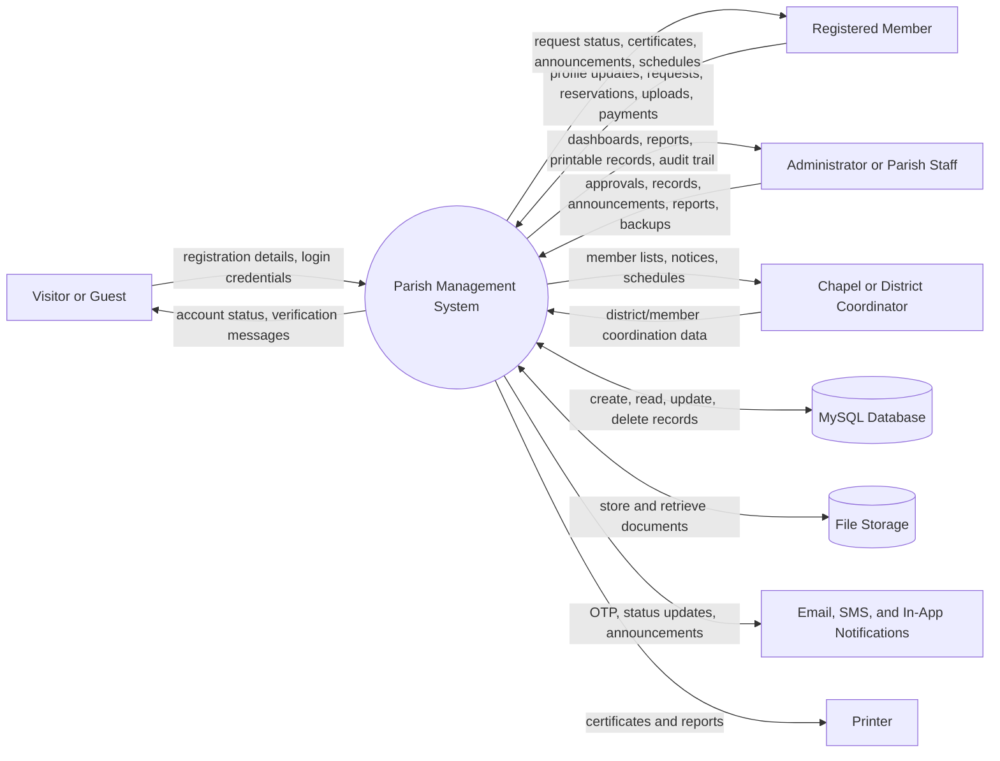
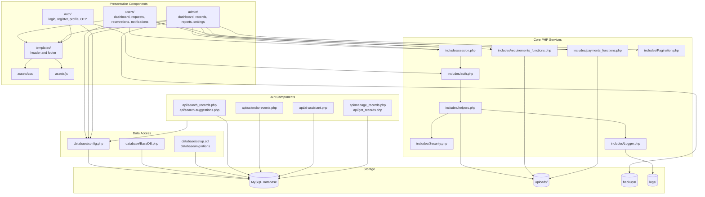
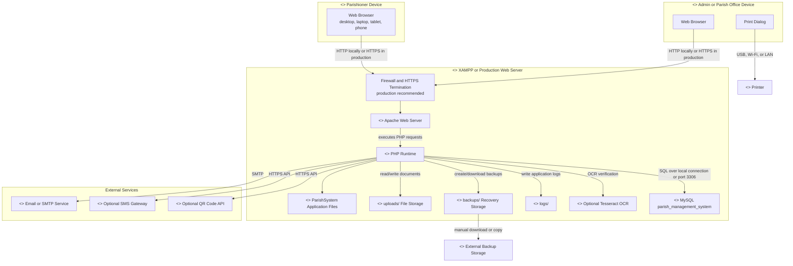

# Parish Management System - System Diagram Package

This document provides documentation-ready system diagrams for the Parish Management System. The diagrams are written in Mermaid syntax so they can be rendered in Markdown tools that support Mermaid, or copied into diagramming tools such as Draw.io, Lucidchart, Visual Paradigm, or Mermaid Live Editor.

## System Scope

The system is a PHP and MySQL web application hosted in a XAMPP/Apache environment. It supports parishioner registration, login, profile management, certificate and service requests, sacramental records, reservations, announcements, schedule events, notifications, payment receipts, document uploads, reports, backups, audit logs, and optional AI/OCR/OTP support.

Primary implemented roles:

- Administrator and parish staff: represented by admin accounts using `users.role = 'admin'`.
- Registered members and parishioners: represented by user accounts using `users.role = 'user'`.
- Chapel or district coordinators: supported as an organizational responsibility; chapel/district information is currently stored in `users.chapel_district`.
- Visitors or guests: may access public login, registration, announcements, and landing pages before becoming registered users.

Implementation note: separate `roles`, `members`, `families`, and `chapels` tables are not currently present in the core schema. Their responsibilities are implemented through `users.role`, `users` profile fields, and `users.chapel_district`. They can be separated into dedicated tables in a future normalization phase.

## 1. Complete System Architecture Diagram

Purpose: Shows the major frontend, backend, database, file storage, and external service components and how data flows through the system.

```mermaid
flowchart TB
    subgraph Client["Client Layer"]
        Guest["Visitor or Guest<br/>Browser"]
        Member["Registered Member<br/>Browser"]
        AdminUser["Administrator or Parish Staff<br/>Browser"]
        Coordinator["Chapel or District Coordinator<br/>Browser"]
    end

    subgraph Server["Server Layer - Apache/XAMPP"]
        Apache["Apache Web Server<br/>HTTP request handling"]
        PHP["PHP Application Runtime"]
    end

    subgraph App["Application Layer - ParishSystem PHP Modules"]
        Auth["Authentication and Session Module<br/>login, registration, OTP, password change"]
        UserMgmt["User and Profile Management<br/>verification, status, role, preferences"]
        Requests["Request Management<br/>certificates, blessings, reservations, payments"]
        Records["Sacramental Records Management<br/>baptism, confirmation, communion, marriage, funeral"]
        Events["Calendar and Reservation Management<br/>schedule events, bookings"]
        Documents["Document and Certificate Management<br/>requirements, receipts, released certificates"]
        Announcements["Announcement and Notification Management<br/>posts, attachments, in-app notices"]
        Reports["Reports and Analytics<br/>requests, users, records, activity"]
        Audit["Audit, Backup, and Settings<br/>logs, recovery, maintenance"]
        API["AJAX and API Endpoints<br/>search, calendar, assistant"]
    end

    subgraph Data["Database Layer - MySQL parish_management_system"]
        Users[(users)]
        RequestsDB[(requests)]
        DocsDB[(request_documents<br/>request_payments)]
        CertReqDB[(Certificate_Requests<br/>Request_Requirements<br/>Payment_Receipts<br/>Certificate_Files)]
        RecordsDB[(sacramental record tables)]
        EventsDB[(reservations<br/>schedule_events)]
        AnnDB[(announcements<br/>announcement_recipients)]
        NotifyDB[(notifications<br/>notification_logs<br/>sms_notification_logs)]
        AuditDB[(audit_log<br/>Audit_Logs)]
        SecurityDB[(otp_codes<br/>email_verifications)]
        ChatDB[(chatbot_inquiries)]
    end

    subgraph Files["File Storage Layer"]
        Uploads["uploads/<br/>valid IDs, face captures, requirements, receipts, certificates"]
        Backups["backups/<br/>database and full-system recovery packages"]
        Assets["assets/<br/>CSS, JavaScript, images"]
    end

    subgraph External["External or Optional Services"]
        SMTP["Email or SMTP Service"]
        SMS["SMS Gateway<br/>optional"]
        OCR["Tesseract OCR<br/>optional local process"]
        QR["QR Code Service<br/>optional certificate verification"]
        Printer["Printer<br/>certificates and reports"]
    end

    Guest -->|"register, login, view public pages"| Apache
    Member -->|"requests, uploads, payments, status tracking"| Apache
    AdminUser -->|"management, reports, certificates, backups"| Apache
    Coordinator -->|"district coordination and member support"| Apache

    Apache --> PHP
    PHP --> Auth
    PHP --> UserMgmt
    PHP --> Requests
    PHP --> Records
    PHP --> Events
    PHP --> Documents
    PHP --> Announcements
    PHP --> Reports
    PHP --> Audit
    PHP --> API

    Auth --> Users
    Auth --> SecurityDB
    UserMgmt --> Users
    Requests --> RequestsDB
    Requests --> DocsDB
    Requests --> CertReqDB
    Records --> RecordsDB
    Records --> RequestsDB
    Events --> EventsDB
    Announcements --> AnnDB
    Announcements --> NotifyDB
    Reports --> Users
    Reports --> RequestsDB
    Reports --> RecordsDB
    Reports --> EventsDB
    Reports --> AnnDB
    Reports --> AuditDB
    Audit --> AuditDB
    Audit --> Backups
    API --> ChatDB

    Documents --> Uploads
    Announcements --> Uploads
    UserMgmt --> Uploads
    PHP --> Assets

    Auth --> SMTP
    Auth --> SMS
    Announcements --> SMTP
    Requests --> SMTP
    UserMgmt --> OCR
    Documents --> QR
    AdminUser --> Printer
```

## 2. Database Relationship Diagram

Purpose: Summarizes the main data entities and relationships used by the system. This is not a full physical ERD; the complete DBML file is available in `docs/parish-system-erd.dbml`.

```mermaid
erDiagram
    USERS ||--o{ REQUESTS : submits
    USERS ||--o{ RESERVATIONS : makes
    USERS ||--o{ NOTIFICATIONS : receives
    USERS ||--o{ ANNOUNCEMENTS : publishes
    USERS ||--o{ SCHEDULE_EVENTS : creates
    USERS ||--o{ REQUEST_DOCUMENTS : uploads
    USERS ||--o{ REQUEST_PAYMENTS : pays
    USERS ||--o{ AUDIT_LOG : performs
    USERS ||--o{ OTP_CODES : verifies
    USERS ||--o{ EMAIL_VERIFICATIONS : confirms
    USERS ||--o{ CHATBOT_INQUIRIES : asks

    REQUESTS ||--o{ REQUEST_DOCUMENTS : has
    REQUESTS ||--o{ REQUEST_PAYMENTS : has
    REQUESTS ||--o| BAPTISM_RECORDS : may_create
    REQUESTS ||--o| CONFIRMATION_RECORDS : may_create
    REQUESTS ||--o| FIRST_COMMUNION_RECORDS : may_create
    REQUESTS ||--o| MARRIAGE_RECORDS : may_create
    REQUESTS ||--o| FUNERAL_RECORDS : may_create

    ANNOUNCEMENTS ||--o{ ANNOUNCEMENT_RECIPIENTS : targets
    USERS ||--o{ ANNOUNCEMENT_RECIPIENTS : receives

    RESERVATIONS ||--o| SCHEDULE_EVENTS : syncs_to

    BAPTISM_RECORDS ||--o{ CERTIFICATE_ISSUANCES : issues
    CONFIRMATION_RECORDS ||--o{ CERTIFICATE_ISSUANCES : issues
    FIRST_COMMUNION_RECORDS ||--o{ CERTIFICATE_ISSUANCES : issues
    MARRIAGE_RECORDS ||--o{ CERTIFICATE_ISSUANCES : issues
    FUNERAL_RECORDS ||--o{ CERTIFICATE_ISSUANCES : issues

    CERTIFICATE_REQUESTS ||--o{ REQUEST_REQUIREMENTS : requires
    CERTIFICATE_REQUESTS ||--o{ PAYMENT_RECEIPTS : has
    CERTIFICATE_REQUESTS ||--o{ CERTIFICATE_FILES : releases
```

Major implemented entities:

- `users`: registered parishioners, admins, profile details, verification status, chapel/district.
- `requests`: certificate, blessing, and other parish service requests.
- `request_documents`, `request_payments`: uploaded requirements and payment records tied to requests.
- `Certificate_Requests`, `Request_Requirements`, `Payment_Receipts`, `Certificate_Files`: newer certificate request workflow tables.
- `baptism_records`, `confirmation_records`, `first_communion_records`, `marriage_records`, `funeral_records`: sacramental record modules.
- `reservations`, `schedule_events`: booking and calendar data.
- `announcements`, `announcement_recipients`, `notifications`: communication data.
- `audit_log`, `Audit_Logs`: activity and system logs.
- `otp_codes`, `email_verifications`: account verification and login security.
- `chatbot_inquiries`: AI assistant inquiry history.

## 3. Data Flow Diagram - Level 0

Purpose: Presents the system as one high-level process and shows how external actors exchange data with it.

## 4. Data Flow Diagram - Level 1

Purpose: Decomposes the Parish Management System into major processes and shows the data stores used by each process.

```mermaid
flowchart TB
    Guest[Visitor or Guest]
    Member[Registered Member]
    Admin[Administrator or Parish Staff]
    Coordinator[Chapel or District Coordinator]

    P1((1.0 Authentication and User Management))
    P2((2.0 Member and Verification Management))
    P3((3.0 Request and Certificate Processing))
    P4((4.0 Sacramental Records Management))
    P5((5.0 Event and Reservation Management))
    P6((6.0 Announcement and Notification Management))
    P7((7.0 Reports, Audit, and Backup))
    P8((8.0 AI Assistant and Search APIs))

    D1[(D1 Users, OTP, Email Verification)]
    D2[(D2 Requests, Documents, Payments)]
    D3[(D3 Sacramental Records)]
    D4[(D4 Reservations and Schedule Events)]
    D5[(D5 Announcements and Notifications)]
    D6[(D6 Audit Logs and Backups)]
    D7[(D7 Uploaded Files)]
    D8[(D8 Chatbot Inquiries)]

    Guest -->|"registration, credentials"| P1
    Member -->|"login, profile updates"| P1
    Admin -->|"admin login"| P1
    P1 <-->|"account, session, OTP data"| D1
    P1 -->|"verification email or OTP"| D5

    Admin -->|"verify or reject accounts"| P2
    Coordinator -->|"member coordination updates"| P2
    P2 <-->|"profile, status, chapel/district"| D1
    P2 <-->|"valid ID and face images"| D7

    Member -->|"certificate request, blessing request, payment receipt"| P3
    P3 <-->|"request status, requirements, payments"| D2
    P3 <-->|"uploaded requirements and released certificates"| D7
    P3 -->|"status notification"| D5
    Admin -->|"approve, reject, process, release"| P3

    Admin -->|"add, update, search records"| P4
    P4 <-->|"baptism, confirmation, communion, marriage, funeral"| D3
    P4 <-->|"linked request reference"| D2

    Member -->|"reservation request"| P5
    Admin -->|"calendar and reservation approval"| P5
    Coordinator -->|"district schedules"| P5
    P5 <-->|"reservations and schedule events"| D4
    P5 -->|"schedule notices"| D5

    Admin -->|"create and publish announcements"| P6
    P6 <-->|"announcements, recipients, notifications"| D5
    P6 <-->|"announcement attachments"| D7
    P6 -->|"published notices"| Member
    P6 -->|"published notices"| Coordinator

    Admin -->|"generate reports, backups, audit review"| P7
    P7 <-->|"report source data"| D1
    P7 <-->|"request metrics"| D2
    P7 <-->|"record metrics"| D3
    P7 <-->|"event metrics"| D4
    P7 <-->|"announcement metrics"| D5
    P7 <-->|"logs and backup files"| D6

    Member -->|"assistant question, search input"| P8
    Admin -->|"record search, assistant question"| P8
    P8 <-->|"search results"| D3
    P8 <-->|"inquiry log"| D8
```

## 5. Use Case Diagram

Purpose: Identifies system actors and the major functions available to each role.

```mermaid
flowchart LR
    Guest["Visitor or Guest"]
    Member["Registered Member"]
    Coord["Chapel or District Coordinator"]
    Staff["Parish Staff"]
    Admin["Administrator"]

    subgraph U["Parish Management System Use Cases"]
        UC1(("Register Account"))
        UC2(("Login and Logout"))
        UC3(("Verify Email or OTP"))
        UC4(("Manage Profile"))
        UC5(("Submit Certificate Request"))
        UC6(("Submit Blessing or Service Request"))
        UC7(("Make Reservation"))
        UC8(("Upload Requirements or Receipts"))
        UC9(("Track Request Status"))
        UC10(("View Announcements"))
        UC11(("View Schedule"))
        UC12(("Download Released Certificate"))
        UC13(("Manage Users and Verification"))
        UC14(("Manage Sacramental Records"))
        UC15(("Manage Requests and Payments"))
        UC16(("Generate Certificates"))
        UC17(("Manage Reservations and Calendar"))
        UC18(("Post Announcements"))
        UC19(("Generate Reports"))
        UC20(("View Audit Logs"))
        UC21(("Manage Backups and Settings"))
        UC22(("Search Records"))
        UC23(("Use AI Assistant"))
    end

    Guest --> UC1
    Guest --> UC2
    Guest --> UC10

    Member --> UC2
    Member --> UC3
    Member --> UC4
    Member --> UC5
    Member --> UC6
    Member --> UC7
    Member --> UC8
    Member --> UC9
    Member --> UC10
    Member --> UC11
    Member --> UC12
    Member --> UC23

    Coord --> UC2
    Coord --> UC10
    Coord --> UC11
    Coord --> UC22
    Coord --> UC17

    Staff --> UC2
    Staff --> UC13
    Staff --> UC14
    Staff --> UC15
    Staff --> UC16
    Staff --> UC17
    Staff --> UC18
    Staff --> UC19
    Staff --> UC22

    Admin --> UC13
    Admin --> UC14
    Admin --> UC15
    Admin --> UC16
    Admin --> UC17
    Admin --> UC18
    Admin --> UC19
    Admin --> UC20
    Admin --> UC21
    Admin --> UC23
```

## 6. Component Diagram

Purpose: Shows the software components, directories, and their dependencies inside the application.

## 7. Deployment Diagram

Purpose: Shows the physical or runtime deployment of the system across user devices, server components, storage, and external services.

Deployment notes:

- Development URL: `http://localhost/ParishSystem/`.
- Production URL: should use HTTPS with SSL/TLS.
- Development can run Apache, PHP, MySQL, files, and backups on one XAMPP machine.
- Production should enforce HTTPS, secure file permissions, scheduled backups, database backup retention, and restricted access to uploaded private files.

## 8. Major System Processes

### Registration and Verification

1. Visitor submits registration form with personal details, email, mobile number, chapel/district, valid ID, and face capture.
2. PHP validates input, hashes passwords, encrypts sensitive identity data, and stores the account in `users`.
3. The system creates email verification or OTP records in `email_verifications` or `otp_codes`.
4. Admin reviews pending users in the verification module and approves or rejects the account.
5. Audit and notification records are created where applicable.

### Login and Access Control

1. User submits credentials from the browser.
2. Authentication module validates password hash and account status from `users`.
3. Optional OTP verification is performed.
4. Session data is created and the user is redirected based on role.
5. Admin-only pages check role before allowing access.

### Certificate and Service Request Processing

1. Registered member submits a certificate, blessing, or service request.
2. System generates a reference number and stores the request in `requests` or the certificate request workflow tables.
3. Member uploads requirements or payment receipts, stored in `uploads/` and linked in database tables.
4. Admin reviews the request, verifies documents and payments, and updates status.
5. Certificate may be generated or uploaded, then released to the member.
6. Notifications and audit logs document the workflow.

### Sacramental Records Management

1. Admin or parish staff adds or updates baptism, confirmation, first communion, marriage, or funeral records.
2. Records may be linked to a request using `request_id`.
3. Search APIs retrieve records for admin workflows and certificate generation.
4. Certificate issuance records store certificate number, verification code, issuer, and issue date.

### Announcements and Notifications

1. Admin creates announcements and optional attachments.
2. Announcement details are stored in `announcements`; recipients may be tracked in `announcement_recipients`.
3. Members view notices through the user interface.
4. In-app notifications are stored in `notifications`; email or SMS can be sent through configured services.

### Reports, Audit, and Backup

1. Admin selects report type and date range.
2. Reports module queries users, requests, records, reservations, announcements, chatbot inquiries, and audit logs.
3. Metrics and tabular reports are rendered in the admin interface.
4. Backup functions export database data and package project files into `backups/`.
5. Recovery and maintenance actions are logged.

## 9. Diagram Usage Notes

- For a capstone defense, use the System Architecture Diagram first to explain the overall architecture.
- Use DFD Level 0 to explain external actors and major information exchanges.
- Use DFD Level 1 to explain internal process decomposition.
- Use the Use Case Diagram to explain role-based functional scope.
- Use the Component Diagram to explain code organization.
- Use the Deployment Diagram to explain runtime infrastructure.
- Use the Database Relationship Diagram with `docs/parish-system-erd.svg` or `docs/parish-system-erd.dbml` for the data design portion.
